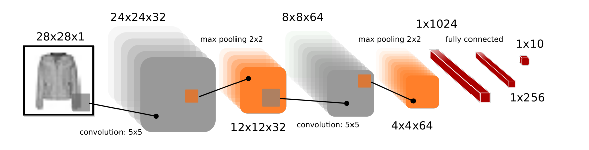

Using PyTorch, on FashionMNIST dataset a convolutional neural network is trained for image classification task.

The dataset consists of 60,000 training images and 10,000 test images of grayscale nature. Each image is of 28x28 dimension and each is assisiated with a label from 10 classes (0-9).

The network's architecture implemented to execute the multi-class classification task is as following :

For training purpose the following conditions are set:
* ReLU as activation function
* Weights are initialised using Xavier initialisation
* SGD optimiser with learning rate of 0.1
* 50 epochs are used for training

Learning rate is changed to 0.001, 0.1, 0.5, 1, 10 with ReLU as activtion function. Later, different activation functions are used such as Tanh, Sigmoid and ELU to note their impact while training the model. Finally dropout is also used on the second fully connected layer to address overfitting.